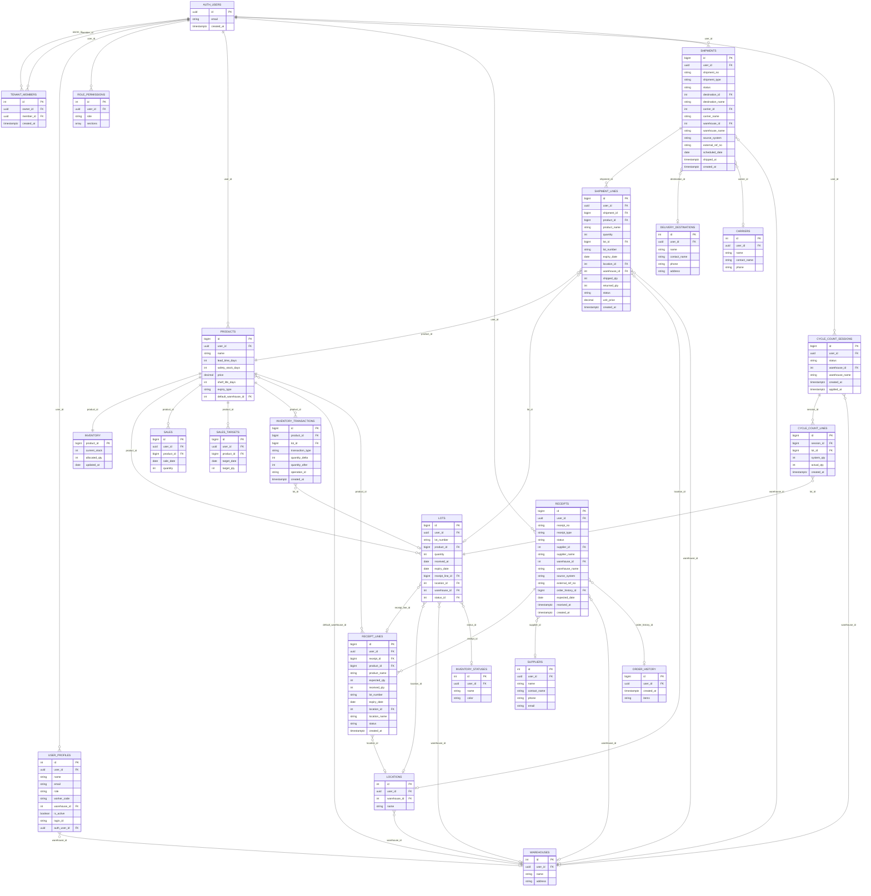
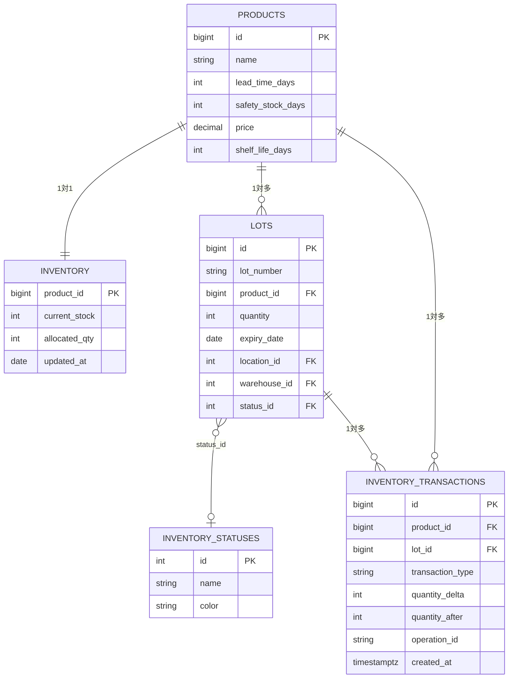
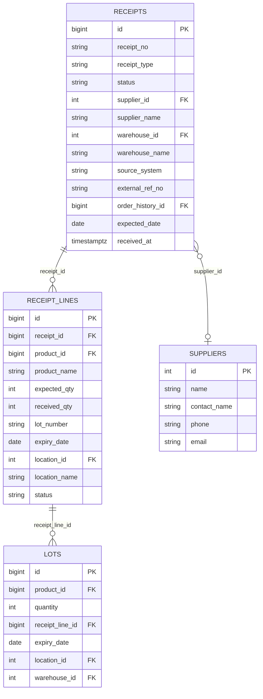
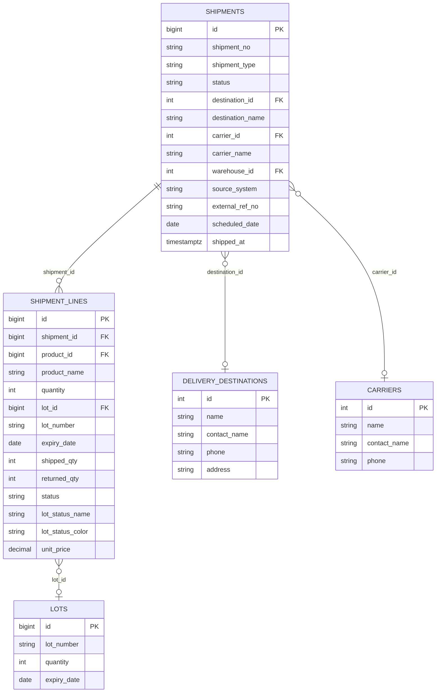
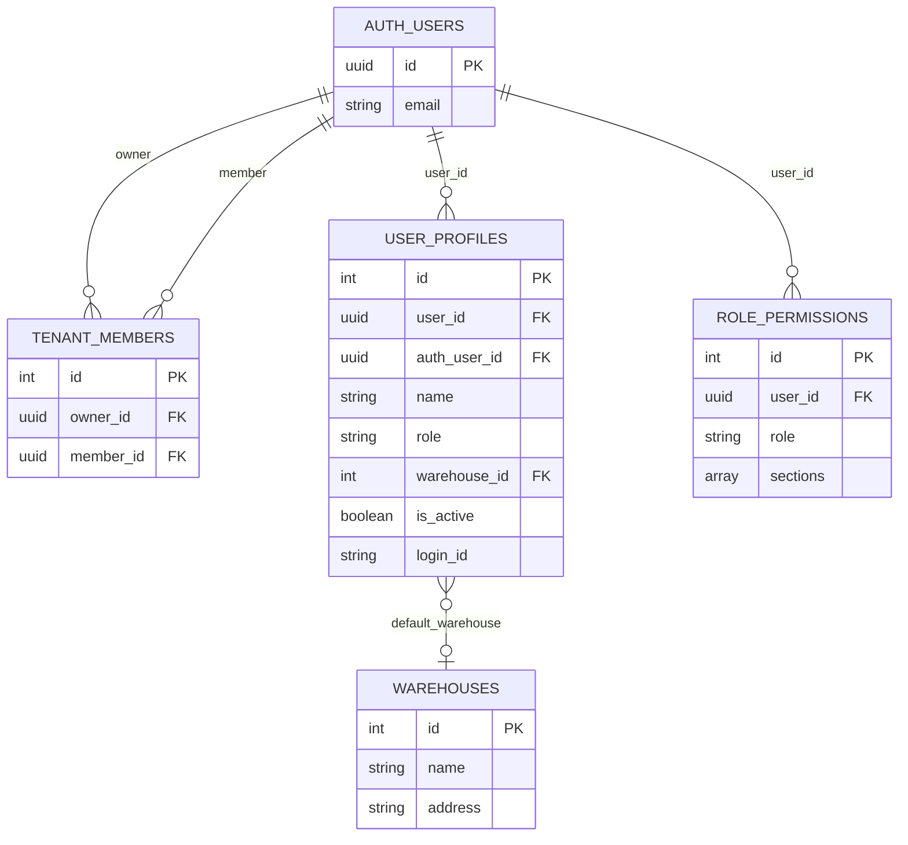

# ER図 — order-assist WMS

## 1. 全体 ER 図

---

## 2. 在庫ドメインの詳細

| カラム | 備考 |
|--------|------|
| `inventory.current_stock` | 出荷可能な実在庫 |
| `inventory.allocated_qty` | 引当済みで未出荷の数量 |
| `lots.expiry_date` | FEFO 引当の基準（賞味期限昇順で選択） |
| `inventory_transactions.operation_id` | UNIQUE 制約（二重処理防止） |
| `inventory_transactions.transaction_type` | incoming / cancel_incoming / outgoing / cancel_outgoing / allocate / deallocate / cycle_count / adjustment / return |

---

## 3. 入荷ドメインの詳細

| カラム | 備考 |
|--------|------|
| `receipts.status` | expected / receiving / received / discrepancy / cancelled |
| `receipts.receipt_type` | planned / adhoc / return / transfer |
| `receipts.source_system` | manual / csv / api / order |
| `receipt_lines.status` | pending / received / discrepancy / cancelled |
| `receipt_lines.supplier_name` 等 | 作成時にマスタからスナップショット保存 |
| `lots.receipt_line_id` | 入荷明細との紐付け |

---

## 4. 出荷ドメインの詳細

| カラム | 備考 |
|--------|------|
| `shipments.status` | requested / allocated / shortage / picking / picked / shipped / cancelled / on_hold |
| `shipments.shipment_type` | normal / sample / internal_use / disposal / transfer / return_reship |
| `shipment_lines.status` | requested / allocated / shipped / cancelled |
| `shipment_lines.unit_price` | 出荷確定時に products.price からスナップショット |
| `shipment_lines.lot_status_name/color` | 引当時に inventory_statuses からスナップショット |
| `shipment_lines.lot_number / expiry_date` | 引当時に lots からスナップショット |

---

## 5. マルチテナント・権限ドメイン

| 項目 | 備考 |
|------|------|
| `tenant_members` | owner_id のユーザーのデータを member_id のユーザーが共有 |
| `get_owner_id()` | RLS 関数。サブユーザーの場合はオーナーの UUID を返す |
| `user_profiles.role` | admin / office / warehouse / viewer |
| `role_permissions.sections` | 許可セクションキーの配列（orders, incoming, inventory 等） |
| `user_profiles.warehouse_id` | デフォルト倉庫。管理者がユーザーマスタで設定 |

---

## 6. テーブル一覧

| テーブル名 | 区分 | 概要 |
|-----------|------|------|
| `auth.users` | 認証 | Supabase 管理の認証ユーザー |
| `tenant_members` | テナント | オーナー⇔サブユーザーの紐付け |
| `user_profiles` | ユーザー | ユーザー情報・ロール・デフォルト倉庫 |
| `role_permissions` | 権限 | ロール別セクション権限設定 |
| `products` | 商品 | 商品マスタ（リードタイム・安全在庫・価格等） |
| `inventory` | 在庫 | 商品単位の集計在庫（current_stock / allocated_qty） |
| `lots` | 在庫 | ロット単位の在庫（数量・賞味期限・ロケーション） |
| `inventory_transactions` | 在庫 | 全在庫変動の監査ログ |
| `inventory_statuses` | マスタ | ロットステータス定義（検品待ち・返品品等） |
| `sales` | 売上 | 日次売上実績 |
| `sales_targets` | 売上 | 売上目標 |
| `receipts` | 入荷 | 入荷伝票ヘッダー |
| `receipt_lines` | 入荷 | 入荷伝票明細 |
| `shipments` | 出荷 | 出荷伝票ヘッダー |
| `shipment_lines` | 出荷 | 出荷伝票明細 |
| `order_history` | 発注 | 自動発注履歴 |
| `suppliers` | マスタ | 仕入先 |
| `delivery_destinations` | マスタ | 配送先 |
| `carriers` | マスタ | 運送業者 |
| `warehouses` | マスタ | 倉庫 |
| `locations` | マスタ | ロケーション（倉庫内の棚・エリア） |
| `cycle_count_sessions` | 棚卸し | 棚卸しセッション |
| `cycle_count_lines` | 棚卸し | 棚卸し明細（ロット別実数） |

---

## 7. 主要な制約・インデックス

| テーブル | 制約 | 内容 |
|---------|------|------|
| `receipts` | UNIQUE | `(receipt_no, user_id)` |
| `shipments` | UNIQUE | `(shipment_no, user_id)` |
| `sales` | UNIQUE | `(product_id, date)` |
| `inventory` | PRIMARY KEY | `product_id`（商品 1 つにつき 1 レコード） |
| `inventory_transactions` | UNIQUE (部分) | `operation_id` が NULL でない場合のみ一意（二重処理防止） |
| `warehouses` | UNIQUE | `(user_id, name)` |
| `locations` | UNIQUE | `(user_id, warehouse_id, name)` |
| `tenant_members` | UNIQUE | `member_id`（サブユーザーは 1 テナントのみ所属） |
| `role_permissions` | UNIQUE | `(user_id, role)` |
