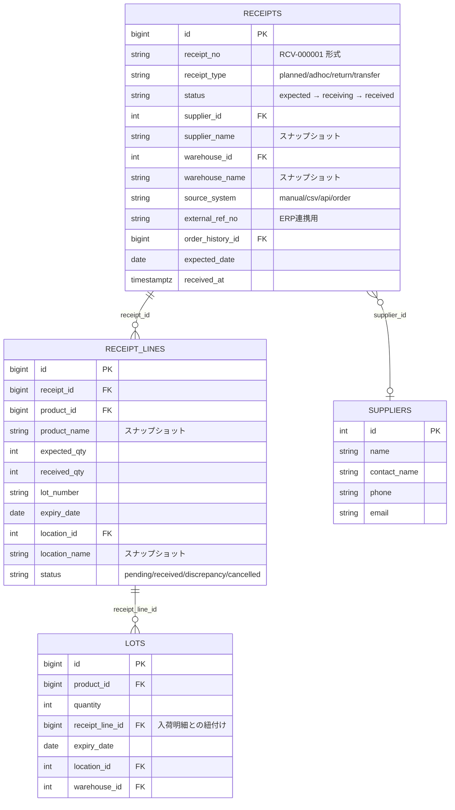
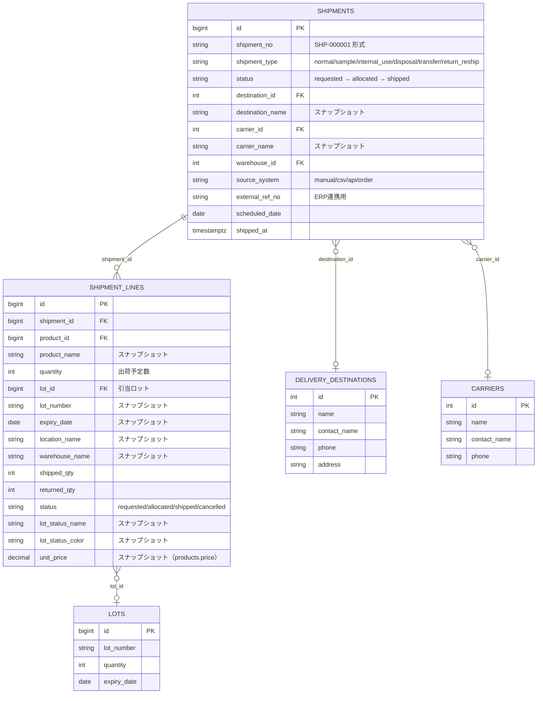
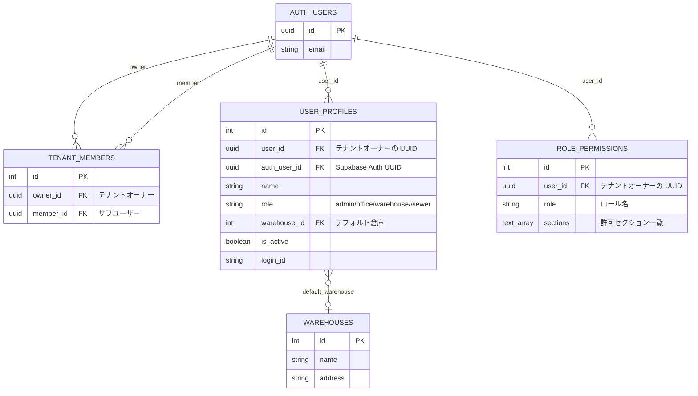

# ER図 — order-assist WMS

## 1. 全体 ER 図

```mermaid
erDiagram

    %% ─── 認証・テナント ───────────────────────────────────────

    AUTH_USERS {
        uuid id PK
        string email
        timestamptz created_at
    }

    TENANT_MEMBERS {
        int id PK
        uuid owner_id FK
        uuid member_id FK
        timestamptz created_at
    }

    USER_PROFILES {
        int id PK
        uuid user_id FK
        string name
        string email
        string phone
        string role
        string worker_code
        int warehouse_id FK
        boolean is_active
        timestamptz last_login_at
        string login_id
        uuid auth_user_id FK
    }

    ROLE_PERMISSIONS {
        int id PK
        uuid user_id FK
        string role
        text_array sections
    }

    %% ─── 商品・在庫 ─────────────────────────────────────────

    PRODUCTS {
        bigint id PK
        uuid user_id FK
        string name
        int lead_time_days
        int safety_stock_days
        decimal price
        int shelf_life_days
        string expiry_type
        int pieces_per_ball
        int balls_per_case
        int cases_per_pallet
        decimal incoming_fee_per_piece
        decimal storage_fee_per_piece
        decimal outgoing_fee_per_piece
        int default_warehouse_id FK
    }

    INVENTORY {
        bigint product_id PK_FK
        int current_stock
        int allocated_qty
        date updated_at
    }

    LOTS {
        bigint id PK
        uuid user_id FK
        string lot_number
        bigint product_id FK
        string product_name
        int quantity
        date received_at
        date expiry_date
        bigint receipt_line_id FK
        int location_id FK
        string location_name
        int warehouse_id FK
        string warehouse_name
        int status_id FK
        string status_name
        string status_color
    }

    INVENTORY_TRANSACTIONS {
        bigint id PK
        bigint product_id FK
        bigint lot_id FK
        string transaction_type
        int quantity_delta
        int quantity_after
        bigint reference_id
        string reference_type
        string operation_id
        string note
        timestamptz created_at
    }

    SALES {
        bigint id PK
        uuid user_id FK
        bigint product_id FK
        date date
        int quantity
    }

    SALES_TARGETS {
        bigint id PK
        uuid user_id FK
        bigint product_id FK
        date date
        int target_qty
    }

    %% ─── 入荷 ───────────────────────────────────────────────

    RECEIPTS {
        bigint id PK
        uuid user_id FK
        string receipt_no
        string receipt_type
        string status
        int supplier_id FK
        string supplier_name
        int warehouse_id FK
        string warehouse_name
        string external_ref_no
        string source_system
        bigint order_history_id FK
        date expected_date
        timestamptz received_at
        string note
        timestamptz created_at
    }

    RECEIPT_LINES {
        bigint id PK
        uuid user_id FK
        bigint receipt_id FK
        bigint product_id FK
        string product_name
        int expected_qty
        int received_qty
        string lot_number
        date expiry_date
        int location_id FK
        string location_name
        string status
        string resolution
        string note
        timestamptz created_at
    }

    %% ─── 出荷 ───────────────────────────────────────────────

    SHIPMENTS {
        bigint id PK
        uuid user_id FK
        string shipment_no
        string shipment_type
        string status
        int destination_id FK
        string destination_name
        int carrier_id FK
        string carrier_name
        int warehouse_id FK
        string warehouse_name
        string external_ref_no
        string source_system
        date scheduled_date
        timestamptz shipped_at
        string on_hold_reason
        string note
        timestamptz created_at
    }

    SHIPMENT_LINES {
        bigint id PK
        uuid user_id FK
        bigint shipment_id FK
        bigint product_id FK
        string product_name
        int quantity
        bigint lot_id FK
        string lot_number
        date expiry_date
        int location_id FK
        string location_name
        int warehouse_id FK
        string warehouse_name
        timestamptz allocated_at
        int shipped_qty
        int returned_qty
        string status
        string lot_status_name
        string lot_status_color
        decimal unit_price
        string note
        timestamptz created_at
    }

    %% ─── 発注履歴 ───────────────────────────────────────────

    ORDER_HISTORY {
        bigint id PK
        uuid user_id FK
        timestamptz created_at
        text items
    }

    %% ─── マスタ ─────────────────────────────────────────────

    SUPPLIERS {
        int id PK
        uuid user_id FK
        string name
        string contact_name
        string phone
        string email
        string address
        string note
    }

    DELIVERY_DESTINATIONS {
        int id PK
        uuid user_id FK
        string name
        string contact_name
        string phone
        string address
        string note
    }

    CARRIERS {
        int id PK
        uuid user_id FK
        string name
        string contact_name
        string phone
        string note
    }

    INVENTORY_STATUSES {
        int id PK
        uuid user_id FK
        string name
        string color
        string note
    }

    WAREHOUSES {
        int id PK
        uuid user_id FK
        string name
        string address
        string note
    }

    LOCATIONS {
        int id PK
        uuid user_id FK
        int warehouse_id FK
        string name
        string note
    }

    %% ─── 棚卸し ─────────────────────────────────────────────

    CYCLE_COUNT_SESSIONS {
        bigint id PK
        uuid user_id FK
        string status
        int warehouse_id FK
        string warehouse_name
        string notes
        timestamptz created_at
        timestamptz applied_at
    }

    CYCLE_COUNT_LINES {
        bigint id PK
        bigint session_id FK
        bigint lot_id FK
        int system_qty
        int actual_qty
        timestamptz created_at
    }

    %% ─── リレーション ────────────────────────────────────────

    AUTH_USERS ||--o{ TENANT_MEMBERS : "owner_id"
    AUTH_USERS ||--o{ TENANT_MEMBERS : "member_id"
    AUTH_USERS ||--o{ USER_PROFILES : "user_id"
    AUTH_USERS ||--o{ ROLE_PERMISSIONS : "user_id"

    AUTH_USERS ||--o{ PRODUCTS : "user_id"
    PRODUCTS ||--|| INVENTORY : "product_id"
    PRODUCTS ||--o{ LOTS : "product_id"
    PRODUCTS ||--o{ SALES : "product_id"
    PRODUCTS ||--o{ SALES_TARGETS : "product_id"
    PRODUCTS ||--o{ INVENTORY_TRANSACTIONS : "product_id"
    PRODUCTS }o--o| WAREHOUSES : "default_warehouse_id"

    AUTH_USERS ||--o{ RECEIPTS : "user_id"
    RECEIPTS ||--o{ RECEIPT_LINES : "receipt_id"
    RECEIPTS }o--o| SUPPLIERS : "supplier_id"
    RECEIPTS }o--o| WAREHOUSES : "warehouse_id"
    RECEIPTS }o--o| ORDER_HISTORY : "order_history_id"
    RECEIPT_LINES }o--|| PRODUCTS : "product_id"
    RECEIPT_LINES }o--o| LOCATIONS : "location_id"

    AUTH_USERS ||--o{ SHIPMENTS : "user_id"
    SHIPMENTS ||--o{ SHIPMENT_LINES : "shipment_id"
    SHIPMENTS }o--o| DELIVERY_DESTINATIONS : "destination_id"
    SHIPMENTS }o--o| CARRIERS : "carrier_id"
    SHIPMENTS }o--o| WAREHOUSES : "warehouse_id"
    SHIPMENT_LINES }o--|| PRODUCTS : "product_id"
    SHIPMENT_LINES }o--o| LOTS : "lot_id"
    SHIPMENT_LINES }o--o| LOCATIONS : "location_id"
    SHIPMENT_LINES }o--o| WAREHOUSES : "warehouse_id"

    LOTS }o--o| RECEIPT_LINES : "receipt_line_id"
    LOTS }o--o| LOCATIONS : "location_id"
    LOTS }o--o| WAREHOUSES : "warehouse_id"
    LOTS }o--o| INVENTORY_STATUSES : "status_id"

    INVENTORY_TRANSACTIONS }o--o| LOTS : "lot_id"

    LOCATIONS }o--|| WAREHOUSES : "warehouse_id"
    USER_PROFILES }o--o| WAREHOUSES : "warehouse_id"

    AUTH_USERS ||--o{ CYCLE_COUNT_SESSIONS : "user_id"
    CYCLE_COUNT_SESSIONS ||--o{ CYCLE_COUNT_LINES : "session_id"
    CYCLE_COUNT_LINES }o--|| LOTS : "lot_id"
    CYCLE_COUNT_SESSIONS }o--o| WAREHOUSES : "warehouse_id"
```

---

## 2. 在庫ドメインの詳細

```mermaid
erDiagram

    PRODUCTS {
        bigint id PK
        string name
        int lead_time_days
        int safety_stock_days
        decimal price
        int shelf_life_days
    }

    INVENTORY {
        bigint product_id PK_FK
        int current_stock "出荷可能な実在庫"
        int allocated_qty "引当済み未出荷数"
        date updated_at
    }

    LOTS {
        bigint id PK
        string lot_number
        bigint product_id FK
        int quantity "このロットの残数"
        date expiry_date "FEFO 引当の基準"
        int location_id FK
        int warehouse_id FK
        int status_id FK
    }

    INVENTORY_TRANSACTIONS {
        bigint id PK
        bigint product_id FK
        bigint lot_id FK
        string transaction_type "incoming/outgoing/allocate/adjustment/cycle_count/return"
        int quantity_delta
        int quantity_after
        string operation_id "UNIQUE（二重処理防止）"
        timestamptz created_at
    }

    INVENTORY_STATUSES {
        int id PK
        string name "例：検品待ち、返品品"
        string color
    }

    PRODUCTS ||--|| INVENTORY : "1対1"
    PRODUCTS ||--o{ LOTS : "1対多"
    PRODUCTS ||--o{ INVENTORY_TRANSACTIONS : "1対多"
    LOTS }o--o| INVENTORY_STATUSES : "status_id"
    LOTS ||--o{ INVENTORY_TRANSACTIONS : "1対多"
```

---

## 3. 入荷ドメインの詳細



---

## 4. 出荷ドメインの詳細



---

## 5. マルチテナント・権限ドメイン



---

## 6. テーブル一覧

| テーブル名 | 区分 | 概要 |
|-----------|------|------|
| `auth.users` | 認証 | Supabase 管理の認証ユーザー |
| `tenant_members` | テナント | オーナー⇔サブユーザーの紐付け |
| `user_profiles` | ユーザー | ユーザー情報・ロール・デフォルト倉庫 |
| `role_permissions` | 権限 | ロール別セクション権限設定 |
| `products` | 商品 | 商品マスタ（リードタイム・安全在庫・価格等） |
| `inventory` | 在庫 | 商品単位の集計在庫（current_stock / allocated_qty） |
| `lots` | 在庫 | ロット単位の在庫（数量・賞味期限・ロケーション） |
| `inventory_transactions` | 在庫 | 全在庫変動の監査ログ |
| `inventory_statuses` | マスタ | ロットステータス定義（検品待ち・返品品等） |
| `sales` | 売上 | 日次売上実績 |
| `sales_targets` | 売上 | 売上目標 |
| `receipts` | 入荷 | 入荷伝票ヘッダー |
| `receipt_lines` | 入荷 | 入荷伝票明細 |
| `shipments` | 出荷 | 出荷伝票ヘッダー |
| `shipment_lines` | 出荷 | 出荷伝票明細 |
| `order_history` | 発注 | 自動発注履歴 |
| `suppliers` | マスタ | 仕入先 |
| `delivery_destinations` | マスタ | 配送先 |
| `carriers` | マスタ | 運送業者 |
| `warehouses` | マスタ | 倉庫 |
| `locations` | マスタ | ロケーション（倉庫内の棚・エリア） |
| `cycle_count_sessions` | 棚卸し | 棚卸しセッション |
| `cycle_count_lines` | 棚卸し | 棚卸し明細（ロット別実数） |

---

## 7. 主要な制約・インデックス

| テーブル | 制約 | 内容 |
|---------|------|------|
| `receipts` | UNIQUE | `(receipt_no, user_id)` |
| `shipments` | UNIQUE | `(shipment_no, user_id)` |
| `sales` | UNIQUE | `(product_id, date)` |
| `inventory` | PRIMARY KEY | `product_id`（商品 1 つにつき 1 レコード） |
| `inventory_transactions` | UNIQUE (部分) | `operation_id` ≠ NULL の場合のみ一意（二重処理防止） |
| `warehouses` | UNIQUE | `(user_id, name)` |
| `locations` | UNIQUE | `(user_id, warehouse_id, name)` |
| `tenant_members` | UNIQUE | `member_id`（サブユーザーは 1 テナントのみ所属） |
| `role_permissions` | UNIQUE | `(user_id, role)` |
