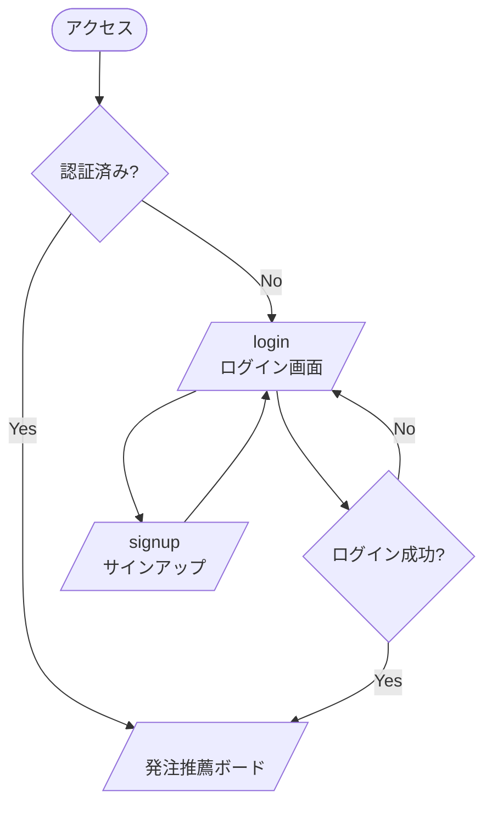
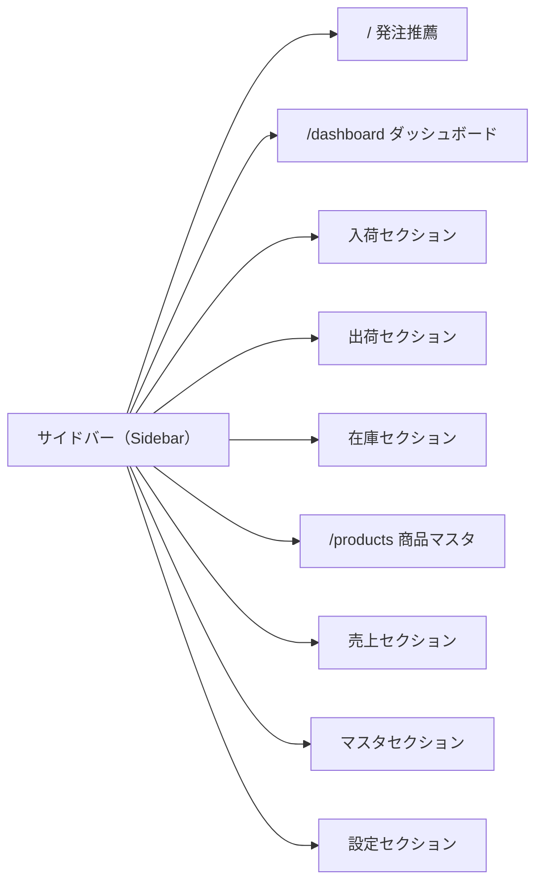
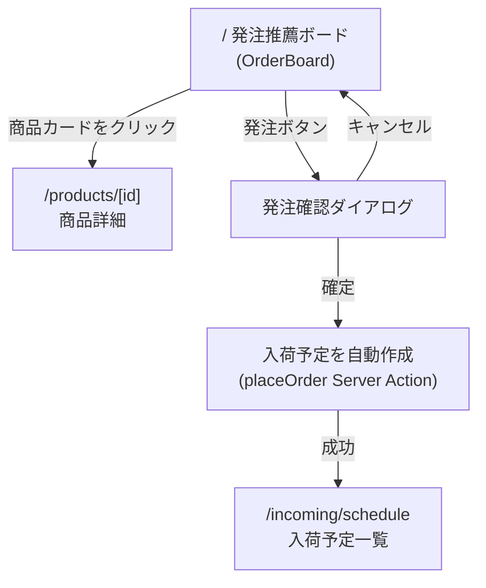
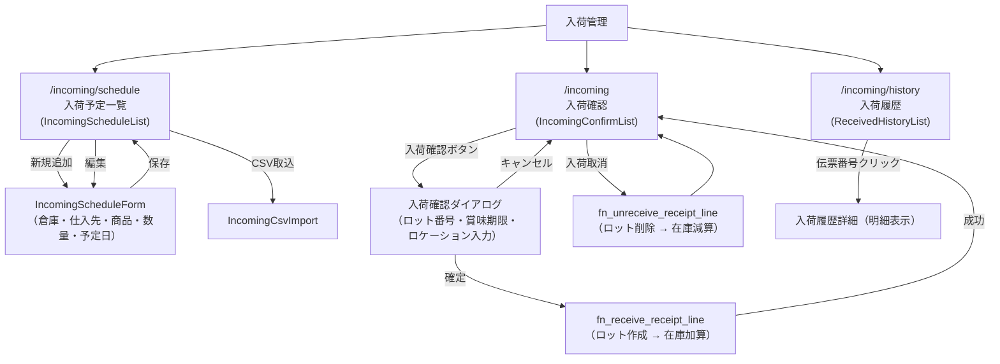
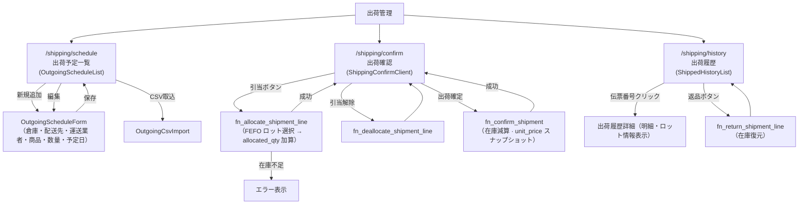
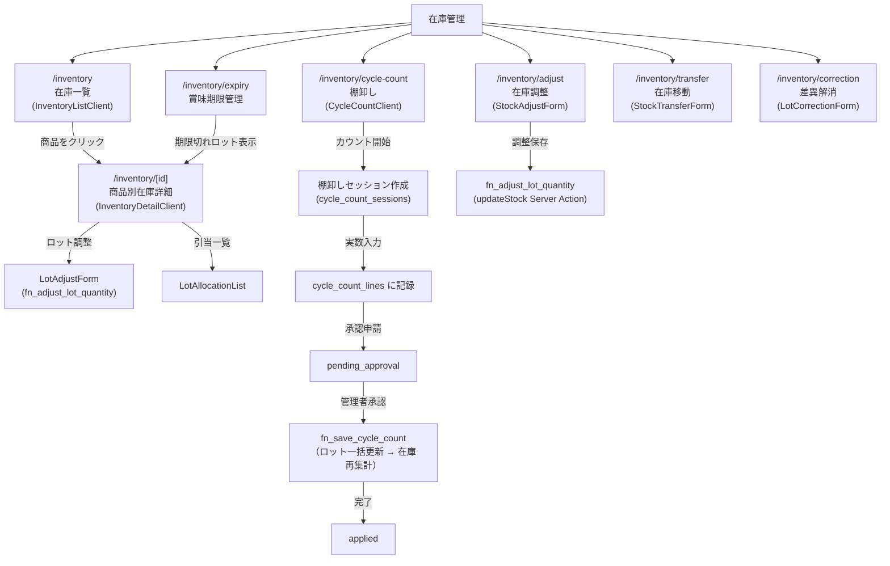
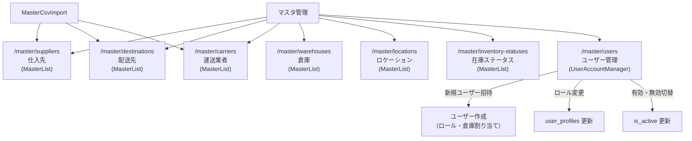
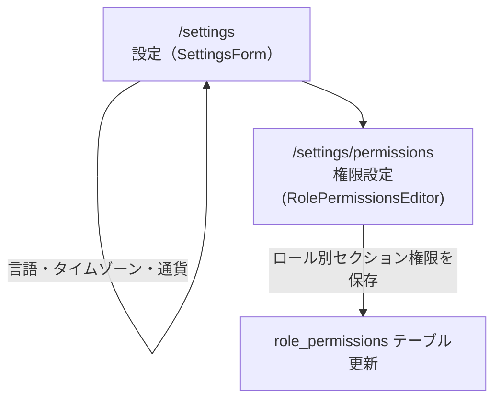
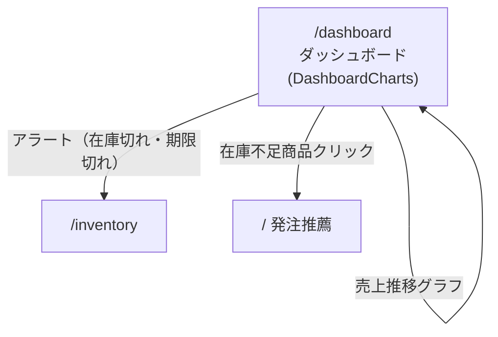

# 画面遷移図 — order-assist WMS

## 1. 認証フロー



---

## 2. 全体ナビゲーション（サイドバー）

権限ロールによってセクションの表示・非表示が制御されます。



---

## 3. 発注推薦（ホーム）



---

## 4. 入荷管理フロー



---

## 5. 出荷管理フロー



---

## 6. 在庫管理フロー



---

## 7. 商品マスタ管理

```mermaid
flowchart TD
    PROD_LIST["/products\n商品一覧\n(ProductListClient)"]
    PROD_LIST --> |新規追加| PROD_FORM["AddProductForm\n（名称・リードタイム・安全在庫日数・価格・棚番等）"]
    PROD_LIST --> |CSV取込| PROD_CSV["ProductCsvImport"]
    PROD_LIST --> |商品クリック| PROD_DETAIL["/products/[id]\n商品詳細"]
    PROD_FORM --> |保存 (addProduct)| PROD_LIST
    PROD_DETAIL --> |編集| PROD_EDIT_FORM["updateProduct Server Action"]
    PROD_DETAIL --> |削除| PROD_DELETE["deleteProduct Server Action"]
    PROD_DELETE --> PROD_LIST
```

---

## 8. 売上管理フロー

```mermaid
flowchart TD
    SALES_TOP["売上管理"]

    SALES_TOP --> SALES_ENTRY["/sales\n売上入力\n(SaleForm)"]
    SALES_TOP --> SALES_IMPORT["/sales/import\nCSV インポート\n(CsvImportForm)"]
    SALES_TOP --> SALES_REPORT["/sales/report\n売上レポート\n(SalesReportCharts)"]
    SALES_TOP --> DAILY_REPORT["/report/daily\n日次レポート\n(DailyReportClient)"]

    SALES_ENTRY --> |保存 (upsertProductSales)| SALES_ENTRY
    SALES_IMPORT --> |CSV アップロード (importSalesCsv)| SALES_ENTRY

    SALES_REPORT --> |期間・商品フィルタ| SALES_REPORT
    DAILY_REPORT --> |日付選択| DAILY_REPORT

    SALES_REPORT --> |CSV エクスポート| EXPORT_API["/api/export-sales"]
```

---

## 9. マスタ管理



---

## 10. 設定フロー



---

## 11. ダッシュボード



---

## 12. 主要画面一覧

| URL | 画面名 | 主なコンポーネント |
|-----|--------|------------------|
| `/` | 発注推薦ボード | OrderBoard, ProductCard |
| `/dashboard` | ダッシュボード | DashboardCharts |
| `/incoming` | 入荷確認 | IncomingConfirmList |
| `/incoming/schedule` | 入荷予定 | IncomingScheduleList, IncomingScheduleForm |
| `/incoming/history` | 入荷履歴 | ReceivedHistoryList |
| `/shipping/schedule` | 出荷予定 | OutgoingScheduleList, OutgoingScheduleForm |
| `/shipping/confirm` | 出荷確認 | ShippingConfirmClient |
| `/shipping/history` | 出荷履歴 | ShippedHistoryList |
| `/inventory` | 在庫一覧 | InventoryListClient |
| `/inventory/[id]` | 在庫詳細 | InventoryDetailClient, LotAdjustForm |
| `/inventory/expiry` | 賞味期限管理 | — |
| `/inventory/cycle-count` | 棚卸し | CycleCountClient |
| `/inventory/adjust` | 在庫調整 | StockAdjustForm |
| `/inventory/transfer` | 在庫移動 | StockTransferForm |
| `/inventory/correction` | 差異解消 | LotCorrectionForm |
| `/products` | 商品一覧 | ProductListClient, AddProductForm |
| `/products/[id]` | 商品詳細 | — |
| `/sales` | 売上入力 | SaleForm |
| `/sales/import` | CSV インポート | CsvImportForm |
| `/sales/report` | 売上レポート | SalesReportCharts |
| `/report/daily` | 日次レポート | DailyReportClient |
| `/master/suppliers` | 仕入先マスタ | MasterList |
| `/master/destinations` | 配送先マスタ | MasterList |
| `/master/carriers` | 運送業者マスタ | MasterList |
| `/master/warehouses` | 倉庫マスタ | MasterList |
| `/master/locations` | ロケーションマスタ | MasterList |
| `/master/inventory-statuses` | 在庫ステータスマスタ | MasterList |
| `/master/users` | ユーザー管理 | UserAccountManager |
| `/settings` | 一般設定 | SettingsForm |
| `/settings/permissions` | 権限設定 | RolePermissionsEditor |
| `/login` | ログイン | — |
| `/signup` | サインアップ | — |
